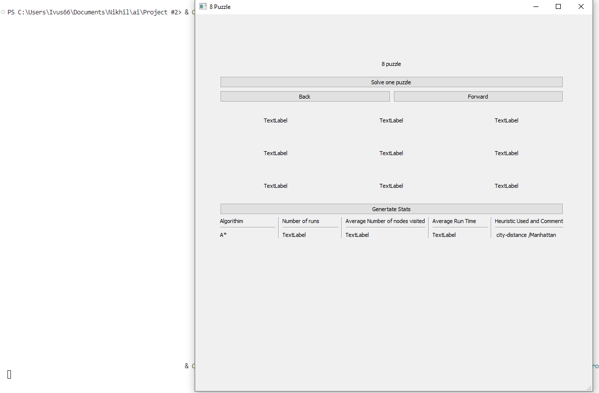
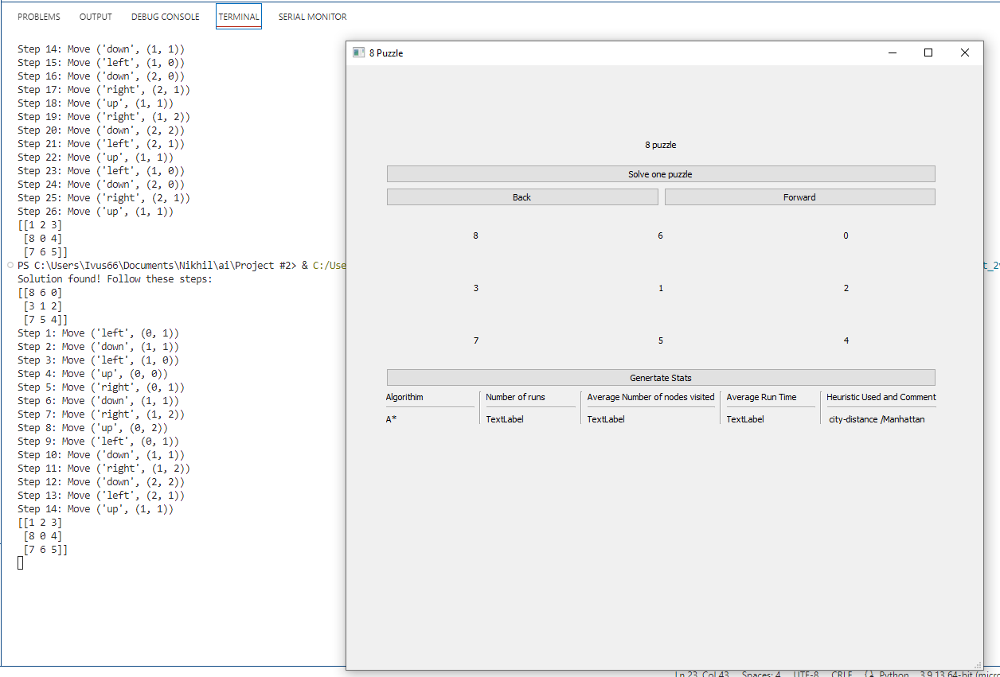
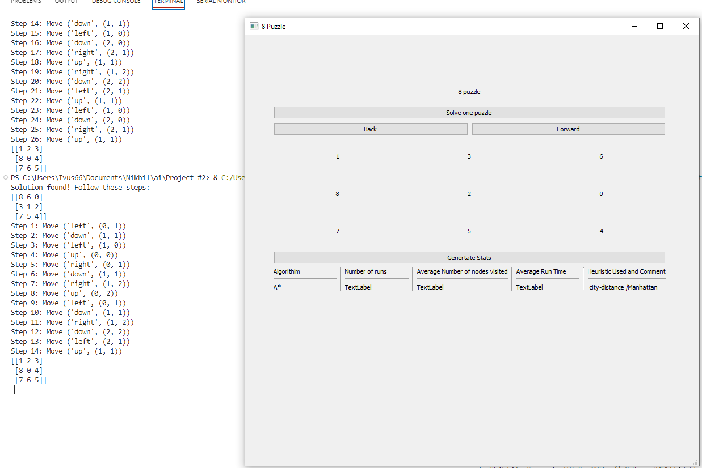
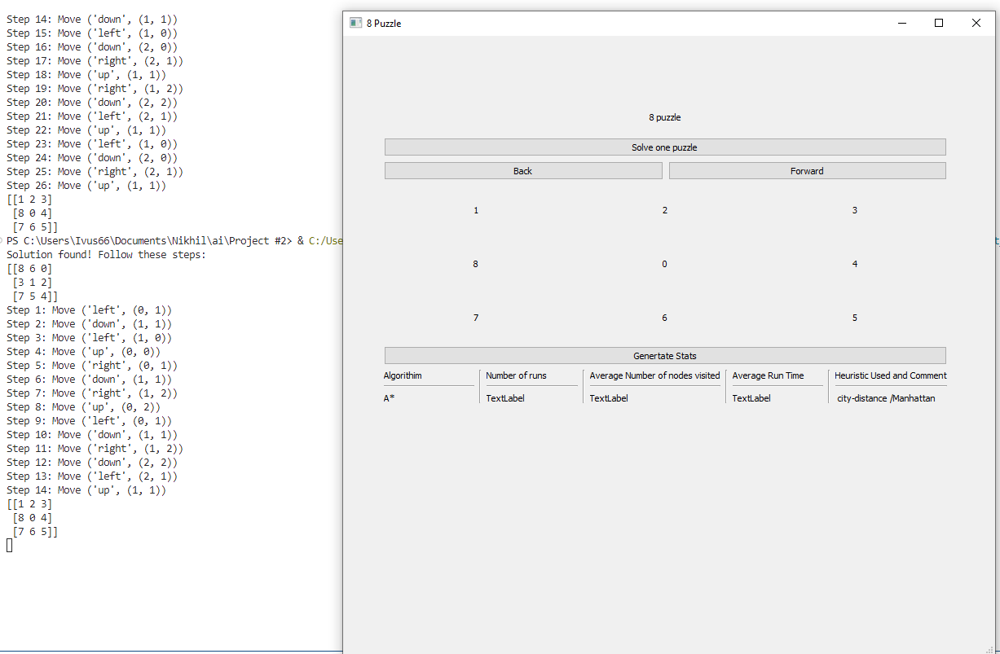
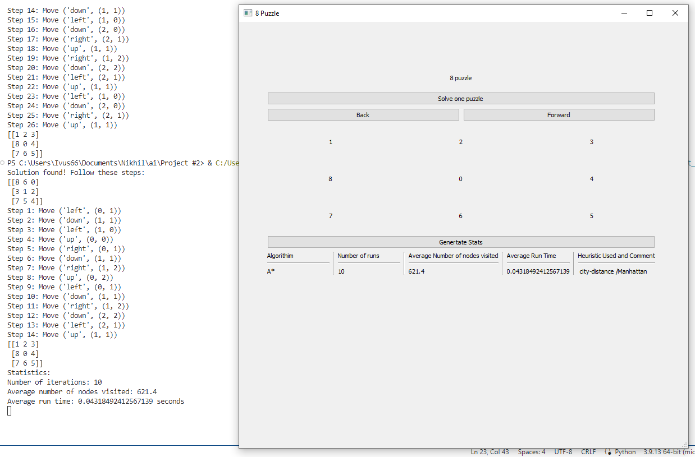

# Explanation

Our objective is to develop an A* algorithm for solving the 8-Puzzle Problem. The 8 puzzle is a classic problem that involves a 3x3 grid with eight numbered tiles and one empty cell(labeled 0). The goal is to rearrange the tiles from a random initial configuration to a predefined goal configuration by sliding the tiles into the empty cell.

The A* algorithm is a popular search algorithm that combines both a heuristic function and the concept of a cost function to efficiently search through a problem space and find the optimal solution.

For this particular implementation, we will be using the Manhattan distance as our heuristic. The Manhattan distance is calculated by summing the horizontal and vertical distances between the current position of a tile and its goal position. By using this heuristic, we can estimate the minimum number of moves required to reach the goal configuration from any given state.

The graphical user interface (GUI) of the program is divided into two sections. The top part is responsible for solving and displaying a single solution to the puzzle, while the bottom part solves multiple problems and generates the desired statistics.

[Video Explanation](https://youtu.be/XgvSqh2mn98?si=G7jy1vFIXzjrmEIa)

## Startup

## Generate Solution

## Iterating Solution 7 steps

## The Complete Solution

## Generate Statistics

